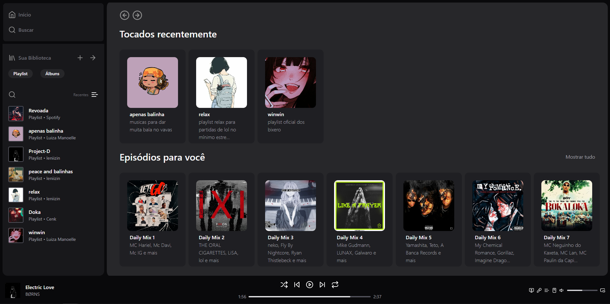

## Visão Geral

### O projeto

- Fazer um clone do Spotify

### Screenshot

### Links

- Live Site URL: [Clone Spotify](https://spotify-replica-beta.vercel.app/)

## Meu processo

### Criado com

- HTML
- Tailwind CSS

### O que eu aprendi

- Aprendi mais sobre Tailwind CSS

## Autor

- GitHub - [João Metzdorf](https://github.com/joaometzdorf)
